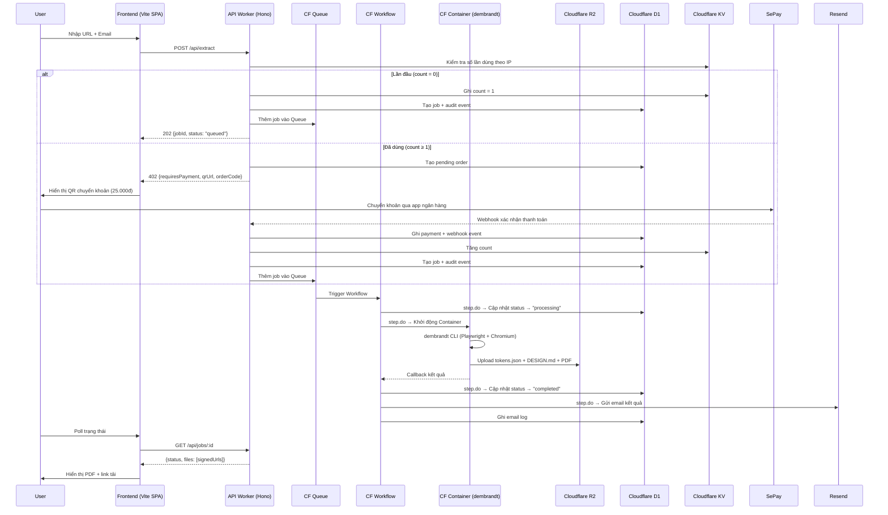
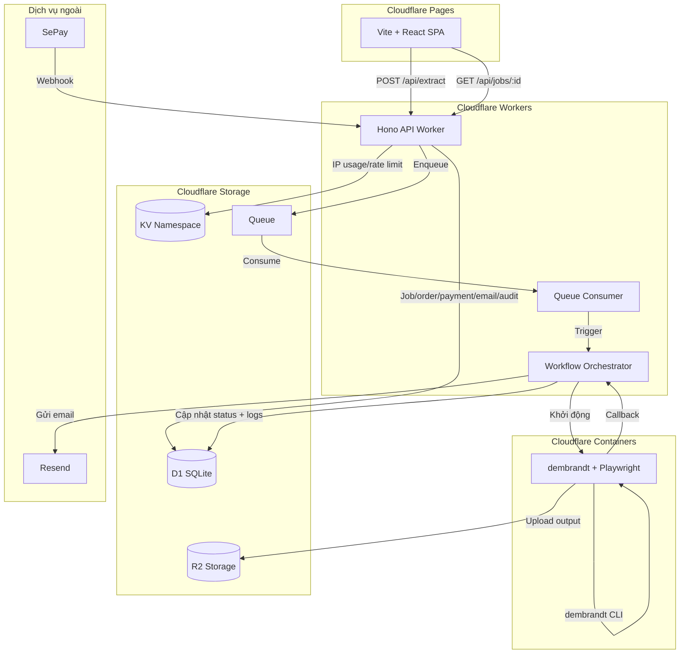

# PRD — OpenDesign Backend

# Dịch vụ trích xuất Design Token từ website

> **Phiên bản:** 2.2 | **Ngày:** 2026-05-06 | **Trạng thái:** Chờ duyệt
> **Thay đổi v2.2:** Bổ sung Cloudflare D1 làm database dài hạn cho job, thanh toán, email log và audit log. D1 docs verified via Context7 (05/2026).

---

## 1. Executive Summary

### Vấn đề

Designer và developer muốn trích xuất design system (màu sắc, typography, spacing, components) từ bất kỳ website nào nhưng phải cài CLI tool `dembrandt` cục bộ, chạy thủ công, tự quản lý file output.

### Giải pháp

Xây backend API đóng gói `dembrandt` CLI:

- User gửi URL từ frontend → backend xếp hàng đợi xử lý
- Output (`.tokens.json`, `DESIGN.md`, `.pdf`) upload lên **Cloudflare R2**
- Job, đơn hàng, thanh toán, webhook, email log và audit log lưu dài hạn trong **Cloudflare D1**
- **Cloudflare KV** chỉ dùng cho cache ngắn hạn, IP usage và rate limit có TTL
- Hoàn thành → gửi email cho user + frontend hiển thị kết quả
- Thanh toán qua **SePay** (chuyển khoản ngân hàng, QR VietQR)

### Tiêu chí thành công

| KPI                   | Mục tiêu |
| --------------------- | -------- |
| Tỷ lệ job hoàn thành  | ≥ 90%    |
| Thời gian xử lý (P95) | ≤ 5 phút |
| Upload R2 thành công  | ≥ 99%    |
| Email gửi thành công  | ≥ 95%    |

---

## 2. User Experience

### 2.1 User Personas

| Persona       | Mô tả                                      | Mục tiêu                                                |
| ------------- | ------------------------------------------ | ------------------------------------------------------- |
| **Designer**  | UI/UX designer audit design system website | Nhận brand guide PDF + design tokens không cần cài tool |
| **Developer** | Frontend dev cần design tokens DTCG        | Lấy `.tokens.json` import vào Style Dictionary          |
| **Agency**    | Quản lý agency audit site cho clients      | Trích xuất nhanh, tải về dùng ngay                      |

### 2.2 User Flow



### 2.3 User Stories

**US-01: Trích xuất miễn phí lần đầu**

> Là designer lần đầu sử dụng, tôi muốn gửi URL và nhận design tokens miễn phí để đánh giá dịch vụ.

- [ ] Nhập URL + email, gửi form
- [ ] Backend nhận diện IP mới (chưa có trong KV)
- [ ] Job được xếp hàng đợi không cần thanh toán
- [ ] Nhận jobId, poll trạng thái được
- [ ] Khi hoàn thành: xem PDF, tải DESIGN.md
- [ ] Nhận email chứa link tải

**US-02: Thanh toán cho lần tiếp theo**

> Là user quay lại, tôi muốn thanh toán 25.000đ (~$1) để trích xuất thêm website.

- [ ] Backend phát hiện IP đã dùng ≥ 1 lần
- [ ] Trả về mã QR chuyển khoản VietQR (SePay)
- [ ] Nội dung chuyển khoản chứa mã đơn hàng (order code)
- [ ] SePay webhook xác nhận → job được xếp hàng đợi
- [ ] Xử lý bình thường sau khi thanh toán

**US-03: Theo dõi trạng thái job**

> Là user đang chờ, tôi muốn biết trạng thái job để biết khi nào có kết quả.

- [ ] `GET /api/jobs/:id` trả về trạng thái hiện tại
- [ ] Các trạng thái: `queued` → `processing` → `completed` / `failed`
- [ ] Khi `completed`: kèm signed URL các file trên R2
- [ ] Khi `failed`: kèm lý do lỗi

**US-04: Nhận email thông báo**

> Là user, tôi muốn nhận email khi hoàn thành để không cần giữ trang web mở.

- [ ] Email gửi đến địa chỉ user cung cấp
- [ ] Chứa link tải PDF, DESIGN.md, tokens.json
- [ ] Link có thời hạn (signed URL 24h)

**US-05: Xem PDF và tải file**

> Là user xem kết quả, tôi muốn xem brand guide PDF trực tiếp và tải DESIGN.md.

- [ ] PDF render trong trình duyệt qua signed R2 URL
- [ ] DESIGN.md tải về dạng raw file
- [ ] File khả dụng ít nhất 7 ngày

### 2.4 Non-Goals (v1.0)

- ❌ Hệ thống đăng nhập / tài khoản
- ❌ Lịch sử trích xuất (dashboard)
- ❌ Gửi nhiều URL cùng lúc
- ❌ Tuỳ chỉnh tham số CLI
- ❌ Streaming tiến trình real-time (WebSocket)
- ❌ Dark mode / mobile viewport extraction
- ❌ Gói subscription

---

## 3. Đặc tả kỹ thuật

### 3.1 Kiến trúc tổng quan



### 3.2 Tech Stack

| Tầng              | Công nghệ                    | Lý do                                                       |
| ----------------- | ---------------------------- | ----------------------------------------------------------- |
| **API**           | Hono on CF Workers           | Lightweight, edge-native, TypeScript, ~14KB                 |
| **Hàng đợi**      | Cloudflare Queues            | Native, at-least-once, zero config, thay BullMQ             |
| **Orchestration** | Cloudflare Workflows         | Durable execution, step retry, sleep, event wait            |
| **Execution**     | Cloudflare Containers        | Docker container chạy dembrandt + Playwright, scale-to-zero |
| **Lưu trữ file**  | Cloudflare R2                | S3-compatible, không phí egress, 10GB free                  |
| **Database dài hạn** | Cloudflare D1             | SQLite serverless cho job, order, payment, email log, audit |
| **Cache/TTL**      | Cloudflare KV                | IP usage, rate limit, dữ liệu tạm có TTL                    |
| **Thanh toán**    | SePay                        | Chuyển khoản ngân hàng VN, webhook tự động, QR VietQR       |
| **Email** | Resend | Email API transactional, React Email templates, 100 emails/ngày free |
| **Frontend**      | Vite + React SPA on CF Pages | Chỉ đọc JSON render, không cần SSR                          |
| **CLI**           | dembrandt (npm)              | Core extraction; chạy trong Container                       |
| **Deploy**        | `wrangler deploy`            | Serverless, auto-scale, không cần VPS                       |

### 3.3 API Specification

#### `POST /api/extract` — Tạo job trích xuất

**Request:**

```json
{
  "url": "https://neon.com",
  "email": "user@example.com"
}
```

**Headers dùng để lấy IP:** `X-Forwarded-For`, `CF-Connecting-IP`, hoặc `req.ip`

**Response — Miễn phí (lần đầu):**

```json
// 202 Accepted
{
  "jobId": "job_a1b2c3d4",
  "status": "queued",
  "message": "Đã xếp hàng xử lý. Email sẽ được gửi khi hoàn thành.",
  "pollUrl": "/api/jobs/job_a1b2c3d4"
}
```

**Response — Yêu cầu thanh toán:**

```json
// 402 Payment Required
{
  "requiresPayment": true,
  "message": "Bạn đã sử dụng lượt miễn phí. Chuyển khoản 25.000đ để tiếp tục.",
  "orderCode": "OD-A1B2C3",
  "amount": 25000,
  "bankInfo": {
    "bank": "Vietcombank",
    "accountNumber": "0123456789",
    "accountName": "NGUYEN VAN A",
    "content": "OD-A1B2C3"
  },
  "qrUrl": "https://qr.sepay.vn/img?acc=0123456789&bank=Vietcombank&amount=25000&des=OD-A1B2C3"
}
```

#### `GET /api/jobs/:jobId` — Trạng thái job

**Hoàn thành:**

```json
{
  "jobId": "job_a1b2c3d4",
  "status": "completed",
  "files": {
    "tokens": { "url": "https://...signed...", "size": 9393 },
    "designMd": { "url": "https://...signed...", "size": 914 },
    "brandGuide": { "url": "https://...signed...", "size": 207358 }
  },
  "completedAt": "2026-05-05T04:25:30Z"
}
```

#### `POST /api/sepay/webhook` — Webhook từ SePay

**Payload SePay gửi:**

```json
{
  "id": 92704,
  "gateway": "Vietcombank",
  "transactionDate": "2026-05-05 14:02:37",
  "accountNumber": "0123456789",
  "code": "OD-A1B2C3",
  "content": "OD-A1B2C3 chuyen khoan",
  "transferType": "in",
  "transferAmount": 25000,
  "accumulated": 500000,
  "referenceCode": "MBVCB.3278907687",
  "description": ""
}
```

**Xử lý:**

1. Xác thực IP nguồn (whitelist SePay: `172.236.138.20`, `172.233.83.68`, `171.244.35.2`, `151.158.108.68`, `151.158.109.79`, `103.255.238.139`)
2. Xác thực API Key trong header `Authorization: Apikey {KEY}`
3. Chống trùng lặp: kiểm tra `provider_transaction_id` trong D1
4. Trích `code` → tìm pending order trong D1
5. Nếu khớp + đúng số tiền → tạo job, xếp hàng đợi
6. Phản hồi: `200 { "success": true }`

**Cấu hình SePay Dashboard:**

- Sự kiện: **Có tiền vào**
- URL: `https://api.opendesign.app/api/sepay/webhook`
- Chứng thực: **API Key**
- Bỏ qua nếu không có code: **Có**

### 3.4 Data Models

#### Cloudflare D1 — Database `opendesign-prod`

D1 là nguồn dữ liệu chuẩn cho dữ liệu quan hệ và log cần giữ dài hạn. Theo docs D1 mới nhất qua Context7: Worker truy cập D1 qua binding `env.DB`, dùng prepared statements (`prepare().bind().run()`), quản lý schema bằng `wrangler d1 migrations`, và có Time Travel để khôi phục theo phút trong 30 ngày gần nhất.

**Bảng `jobs`**

```json
{
  "jobId": "job_a1b2c3d4",
  "url": "https://neon.com",
  "domain": "neon.com",
  "email": "user@example.com",
  "ipHash": "sha256:...",
  "status": "completed",
  "paid": false,
  "orderCode": null,
  "r2Keys": {
    "tokens": "neon.com/job_a1b2c3d4/tokens.json",
    "designMd": "neon.com/job_a1b2c3d4/DESIGN.md",
    "brandGuide": "neon.com/job_a1b2c3d4/brand-guide.pdf"
  },
  "createdAt": "...",
  "completedAt": "..."
}
```

**Retention:** tối thiểu 12 tháng để phục vụ support, đối soát và phân tích vận hành.

**Bảng `orders`**

```json
{
  "orderCode": "OD-A1B2C3",
  "jobId": "job_a1b2c3d4",
  "url": "https://neon.com",
  "email": "user@example.com",
  "ipHash": "sha256:...",
  "amount": 25000,
  "currency": "VND",
  "status": "pending",
  "createdAt": "...",
  "paidAt": null,
  "expiresAt": "..."
}
```

**Bảng `payments`**

```json
{
  "paymentId": "pay_92704",
  "orderCode": "OD-A1B2C3",
  "provider": "sepay",
  "providerTransactionId": "92704",
  "referenceCode": "MBVCB.3278907687",
  "amount": 25000,
  "rawPayload": "{...}",
  "receivedAt": "...",
  "verifiedAt": "..."
}
```

**Bảng `webhook_events`**

```json
{
  "webhookEventId": "wh_92704",
  "provider": "sepay",
  "providerEventId": "92704",
  "orderCode": "OD-A1B2C3",
  "status": "processed",
  "rawPayload": "{...}",
  "receivedAt": "...",
  "processedAt": "..."
}
```

**Bảng `email_logs`**

```json
{
  "emailLogId": "eml_a1b2",
  "jobId": "job_a1b2c3d4",
  "email": "user@example.com",
  "template": "job-completed",
  "provider": "resend",
  "providerMessageId": "resend_...",
  "status": "sent",
  "error": null,
  "sentAt": "..."
}
```

**Bảng `audit_events`**

```json
{
  "eventId": "evt_a1b2",
  "jobId": "job_a1b2c3d4",
  "actorType": "system",
  "eventType": "job.completed",
  "metadata": "{...}",
  "createdAt": "..."
}
```

**Indexes khuyến nghị:**

- `jobs(status, created_at)`, `jobs(email)`, `jobs(domain)`
- `orders(order_code)` unique, `orders(status, expires_at)`
- `payments(provider, provider_transaction_id)` unique
- `webhook_events(provider, provider_event_id)` unique
- `email_logs(job_id, status)`, `audit_events(job_id, created_at)`

#### Cloudflare KV — dữ liệu tạm có TTL

KV không dùng cho dữ liệu cần đối soát dài hạn vì eventual consistency. Chỉ dùng cho rate limit, IP usage và cache nhẹ.

```json
{ "count": 3, "firstSeen": "...", "lastSeen": "..." }
```

**Key:** `ip:{hashedIp}`  
**TTL:** 90 ngày

#### R2: Cấu trúc file

```
opendesign-outputs/{domain}/{jobId}/tokens.json
opendesign-outputs/{domain}/{jobId}/DESIGN.md
opendesign-outputs/{domain}/{jobId}/brand-guide.pdf
```

### 3.5 Execution Pipeline

#### Cloudflare Queue Consumer

- Nhận message từ Queue → trigger Workflow instance
- Batch size: 1 (mỗi job xử lý riêng)

#### Cloudflare Workflow (Durable Execution)

```typescript
export class ExtractionWorkflow extends WorkflowEntrypoint {
  async run(event, step) {
    // Step 1: Cập nhật trạng thái
    await step.do("update-status-processing", async () => {
      await this.env.DB.prepare(
        "UPDATE jobs SET status = ?, started_at = ? WHERE job_id = ?",
      )
        .bind("processing", new Date().toISOString(), event.payload.jobId)
        .run();
    });

    // Step 2: Chạy Container (dembrandt)
    const result = await step.do(
      "run-extraction",
      {
        retries: { limit: 2, delay: "1 minute", backoff: "exponential" },
      },
      async () => {
        // Khởi động Container, chờ kết quả
        return await this.env.CONTAINER.run({ url: event.payload.url });
      },
    );

    // Step 3: Cập nhật hoàn thành
    await step.do("update-status-completed", async () => {
      await this.env.DB.prepare(
        "UPDATE jobs SET status = ?, r2_keys = ?, completed_at = ? WHERE job_id = ?",
      )
        .bind(
          "completed",
          JSON.stringify(result.files),
          new Date().toISOString(),
          event.payload.jobId,
        )
        .run();
    });

    // Step 4: Gửi email
    await step.do("send-email", async () => {
      const emailResult = await sendCompletionEmail(event.payload.email, result.files);
      await this.env.DB.prepare(
        "INSERT INTO email_logs (email_log_id, job_id, email, template, provider, provider_message_id, status, sent_at) VALUES (?, ?, ?, ?, ?, ?, ?, ?)",
      )
        .bind(
          crypto.randomUUID(),
          event.payload.jobId,
          event.payload.email,
          "job-completed",
          "resend",
          emailResult.id,
          "sent",
          new Date().toISOString(),
        )
        .run();
    });
  }
}
```

#### Cloudflare Container (dembrandt executor)

- **Image:** Node.js 20 + dembrandt + Playwright + Chromium
- **Instance type:** `standard-1` (1/2 vCPU, 4GB RAM, 8GB disk)
- **Command:** `dembrandt <url> --save-output --dtcg --design-md --brand-guide --pages 5 --sitemap --slow`
- **Scale-to-zero:** Tự tắt sau khi xong, không tốn tiền idle
- **Timeout:** 5 phút/job
- **Concurrency:** 2 container đồng thời (Playwright ~500MB RAM/instance)
- Thành công → upload R2 → callback Workflow
- Thất bại → Workflow retry (2 lần, exponential backoff)

### 3.6 Bảo mật

| Mối quan ngại         | Giải pháp                                  |
| --------------------- | ------------------------------------------ |
| IP là dữ liệu cá nhân | Hash SHA-256 + salt                        |
| Dữ liệu thanh toán/email | Chỉ lưu metadata cần đối soát, không lưu secret ngân hàng/API key trong D1 |
| Webhook giả mạo       | Whitelist IP SePay + API Key               |
| File R2               | Pre-signed URL 24h                         |
| CLI injection         | Validate URL chặt, không interpolate shell |
| Spam                  | Rate limit 5 req/phút/IP                   |
| DDoS queue            | Max 100 pending jobs                       |

### 3.7 Cấu hình (wrangler.jsonc)

```jsonc
{
  "name": "opendesign-api",
  "main": "src/index.ts",
  "compatibility_date": "2026-04-25",

  // KV Namespace
  "kv_namespaces": [{ "binding": "KV", "id": "<kv-namespace-id>" }],

  // D1 Database — job/order/payment/email/audit dài hạn
  "d1_databases": [
    {
      "binding": "DB",
      "database_name": "opendesign-prod",
      "database_id": "<d1-database-uuid>",
      "preview_database_id": "<d1-preview-database-uuid>",
      "migrations_dir": "migrations",
      "migrations_table": "d1_migrations",
    },
  ],

  // R2 Bucket
  "r2_buckets": [{ "binding": "R2", "bucket_name": "opendesign-outputs" }],

  // Queue — producer & consumer
  "queues": {
    "producers": [{ "queue": "extraction-queue", "binding": "EXTRACT_QUEUE" }],
    "consumers": [
      {
        "queue": "extraction-queue",
        "max_batch_size": 1,
        "max_batch_timeout": 30,
      },
    ],
  },

  // Workflow — durable execution
  "workflows": [
    {
      "name": "extraction-workflow",
      "binding": "EXTRACTION_WORKFLOW",
      "class_name": "ExtractionWorkflow",
    },
  ],

  // Container — dembrandt executor (Durable Object-backed)
  "containers": [
    {
      "class_name": "DembrandtContainer",
      "image": "./container/Dockerfile",
      "instance_type": "standard-1",
      "max_instances": 2,
    },
  ],
  "durable_objects": {
    "bindings": [
      { "class_name": "DembrandtContainer", "name": "DEMBRANDT_CONTAINER" },
    ],
  },
  "migrations": [{ "new_sqlite_classes": ["DembrandtContainer"], "tag": "v1" }],

  // Environment vars (non-secret)
  "vars": {
    "SEPAY_BANK_ACCOUNT": "",
    "SEPAY_BANK_NAME": "",
    "SEPAY_BANK_ACCOUNT_NAME": "",
  },
  // Secrets via: wrangler secret put SEPAY_API_KEY / IP_HASH_SALT / RESEND_API_KEY
}
```

**D1 migrations:**

```bash
npx wrangler d1 migrations create opendesign-prod init_core_tables
npx wrangler d1 migrations apply opendesign-prod --local
npx wrangler d1 migrations apply opendesign-prod --remote
npx wrangler d1 time-travel info opendesign-prod
```

---

## 4. Rủi ro

| Rủi ro                              | Xác suất   | Giải pháp                                              |
| ----------------------------------- | ---------- | ------------------------------------------------------ |
| Dembrandt fail trên site chống bot  | Cao        | Retry `--browser=firefox` via Workflow step retry      |
| CF Containers mới GA                | Thấp       | Docs production-ready (04/2026). Monitor release notes |
| Container cold start chậm           | Trung bình | Scale-to-zero timeout config, warm pool nếu cần        |
| Queues free tier hết (10K ops/ngày) | Thấp       | ~3,300 jobs/ngày free, upgrade paid $0.40/triệu        |
| D1 schema migration lỗi             | Trung bình | Migration review, chạy local trước remote, backup bằng Time Travel |
| D1 write contention tăng            | Thấp       | Ghi theo job/order append-only, index tối thiểu, batch audit khi cần |
| KV eventually consistent            | Thấp       | Chỉ dùng KV cho rate limit/cache, không dùng đối soát  |
| Webhook SePay không đến             | Thấp       | SePay retry 7 lần/5h                                   |
| IP spoofing/VPN                     | Trung bình | Chấp nhận ở mức giá 25K                                |
| Vendor lock-in Cloudflare           | Trung bình | Container layer vẫn portable (Docker)                  |

---

## 5. Lộ trình

**Phase 1: MVP (Tuần 1-2)** — Hono Worker + D1 schema/migrations + KV rate limit + R2 + Queue

**Phase 2: Container (Tuần 2-3)** — Dockerfile dembrandt + CF Container + Workflow orchestration

**Phase 3: Thanh toán + Email (Tuần 3-4)** — SePay QR + webhook + Resend/CF Email + D1 payment/email logs + signed URL

**Phase 4: Frontend (Tuần 4)** — Vite + React SPA + CF Pages + Token Preview

---

## 6. Cấu trúc dự án

```
opendesign/
├── worker/                          # Cloudflare Worker (API + Queue + Workflow)
│   ├── src/
│   │   ├── index.ts                 # Hono app + queue handler
│   │   ├── routes/
│   │   │   ├── extract.ts           # POST /api/extract
│   │   │   ├── jobs.ts              # GET /api/jobs/:id
│   │   │   └── webhook.ts           # POST /api/sepay/webhook
│   │   ├── workflows/
│   │   │   └── extraction.ts        # ExtractionWorkflow class
│   │   ├── services/
│   │   │   ├── r2.ts                # R2 upload + signed URL
│   │   │   ├── db.ts                # D1 queries + transactions
│   │   │   ├── kv.ts                # IP tracking + rate limit cache
│   │   │   ├── audit.ts             # Audit event writer
│   │   │   ├── email.ts             # Resend API client
│   │   │   └── sepay.ts             # Payment logic + QR
│   │   └── types.ts
│   ├── migrations/                  # D1 SQL migrations
│   │   └── 0001_init_core_tables.sql
│   ├── wrangler.toml
│   ├── package.json
│   └── tsconfig.json
│
├── container/                       # CF Container (dembrandt executor)
│   ├── src/
│   │   ├── server.ts                # HTTP server nhận job
│   │   ├── execute.ts               # spawn dembrandt + upload R2
│   │   └── health.ts                # Health check endpoint
│   ├── Dockerfile                   # Node.js 20 + sandbox binary + Playwright
│   └── package.json
│
├── frontend/                        # Vite + React SPA (CF Pages)
│   ├── src/
│   │   ├── App.tsx
│   │   ├── pages/
│   │   │   ├── Home.tsx             # URL input form
│   │   │   ├── Status.tsx           # Job polling
│   │   │   └── Preview.tsx          # Token viewer
│   │   └── components/
│   ├── vite.config.ts
│   └── package.json
│
├── output/ (gitignored)
└── .agent/
```

## 7. Dependencies

### Worker (Cloudflare Worker)

| Package                     | Mục đích                              |
| --------------------------- | ------------------------------------- |
| `hono`                      | Lightweight API framework cho Workers |
| `@cloudflare/workers-types` | TypeScript types cho Workers API      |
| `nanoid`                    | ID generation                         |
| `zod`                       | Request validation                    |
| `resend`                    | Email API (thay Nodemailer)           |
| `wrangler`                  | CLI deploy + dev                      |

> Cloudflare D1 dùng binding `env.DB`, không cần package database client riêng cho MVP.

### Container (dembrandt executor)

| Package                         | Mục đích                  |
| ------------------------------- | ------------------------- |
| `dembrandt`                     | Core extraction CLI       |
| `playwright`                    | Browser automation        |
| `@aws-sdk/client-s3`            | R2 upload (S3-compatible) |
| `@aws-sdk/s3-request-presigner` | Signed URL                |

### Frontend (Vite SPA)

| Package              | Mục đích            |
| -------------------- | ------------------- |
| `react`, `react-dom` | UI framework        |
| `vite`               | Build tool          |
| `react-router-dom`   | Client-side routing |

---

## 8. Chi phí ước tính (MVP)

| Service      | Free Tier                   | Chi phí vượt                 |
| ------------ | --------------------------- | ---------------------------- |
| Workers      | 100K req/ngày               | $5/tháng base                |
| Queues       | 10K ops/ngày (~3,300 jobs)  | $0.40/triệu ops              |
| Containers   | 25 GiB-hrs memory           | $0.000002/GiB-s              |
| D1           | Có free tier cho MVP        | Theo usage và plan Cloudflare hiện hành |
| KV           | 100K reads/ngày             | $0.50/triệu reads            |
| R2           | 10GB storage                | $0.015/GB/tháng              |
| Pages        | Unlimited                   | $0                           |
| **Tổng MVP** | **$0 (nếu dưới free tier)** | **~$5-10/tháng (paid plan)** |
